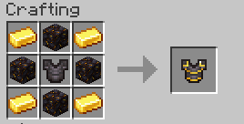

# 1.19-Mod
This is a mod being created for learning purposes.

# Current Features

## Gilded Netherite Armor

Gilded Netherite Armor provides the protection of netherite, combined with the enchantability and piglin protection of gold armor and is crafted like so:

## Enchantments

Molten - Chestplates
* I - Sets attacker on fire for 1 second
* II - Sets attacker on fire for 2 second
* III - Sets attacker on fire for 3 second

Leeching - Weapons
* I - 10% chance to gain quater of your max health back
* II - 15% chance to gain quater of your max health back
* III - 20% chance to gain quater of your max health back

# Contributions

Although I'm using this for learning, contributions and pull requests are still welcome, especially if you want to replace my sub par pixel art!
